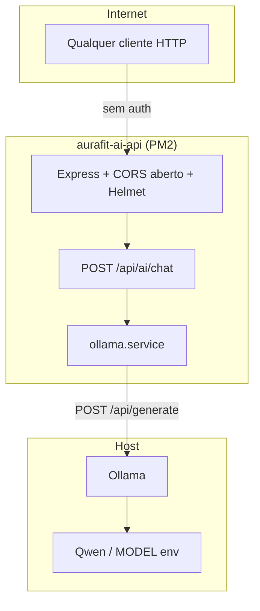
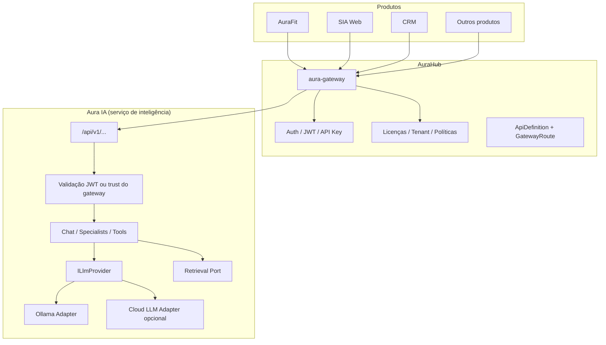

# Análise Arquitetural — Aura IA + AuraHub

> **Projeto analisado:** `aurafit-ai-api` (IA Aura Fit)  
> **Data:** 10/08/2026  
> **Escopo:** análise somente — nenhum código, dependência, migration ou config de produção foi alterado.  
> **Premissa estratégica:** Aura IA será serviço de inteligência da Plataforma Aura, consumido via AuraHub por múltiplos produtos (AuraFit, SIA Web, CRM, futuros).

---

## Resumo executivo

O repositório atual é um **proxy mínimo Express → Ollama** (1 endpoint de chat), funcional e deployável (PM2 + GitHub Actions), porém **ainda não é um serviço de plataforma**. O nome, domínio, health e branding estão acoplados ao AuraFit; não há autenticação, multi-tenancy, versionamento `/api/v1`, abstração de provider, prompts/especialistas, nem contrato alinhado ao AuraHub (gateway, API Key/JWT, tenant).

**Veredito:** base saudável para evoluir sem reescrever o núcleo Ollama, mas **imprópria para consumo multi-produto via AuraHub** no estado atual. A prioridade deve ser: (1) desacoplar identidade “AuraFit” → “Aura IA”; (2) fundação operacional (config, auth, CORS, erros, logging); (3) contrato de provider + specialists; (4) exposição via gateway AuraHub; (5) RAG/tools depois.

---

## 1. Estado atual

### 1.1 Identidade do projeto

| Item | Valor atual |
|------|-------------|
| Pacote npm | `ia-api.aurafitpro.com.br` |
| Descrição | “API de IA AuraFit integrada ao Ollama” |
| Domínio / path VPS | `ia-api.aurafitpro.com.br` |
| PM2 | `aurafit-ai-api` |
| Health | `{ service: "AuraFit AI API" }` |
| Repo GitHub | `devjc24/aurafit-ai-api` |

**Implicação:** o serviço nasceu como extensão do AuraFit, não como produto horizontal da plataforma.

### 1.2 Árvore do repositório

```
aurafit-ai-api/
├── .github/workflows/deploy.yml
├── scripts/deploy.sh
├── docs/
│   ├── ANALISE_ARQUITETURA.md      # análise anterior (01/08/2026)
│   └── CICD.md
├── src/
│   ├── server.ts                   # bootstrap Express
│   ├── routes/ai.routes.ts         # POST /chat
│   └── services/ollama.service.ts  # cliente Ollama
├── package.json
├── package-lock.json
├── tsconfig.json
└── .gitignore
```

**Ausentes:** `config/`, `controllers/`, `middlewares/`, `providers/`, `prompts/`, `types/`, `utils/`, testes, OpenAPI, `.env.example`, README de produto, persistência, RAG, tools.

### 1.3 Stack e dependências

| Tipo | Pacotes |
|------|---------|
| Produção | `express` ^5.1, `axios`, `cors`, `dotenv`, `helmet` |
| Dev | `typescript`, `ts-node-dev`, `@types/*` |

**Não presentes:** JWT/jose, rate-limit, zod, pino/winston, swagger, clients Hub, vector DB, filas.

### 1.4 Rotas

| Método | Path | Comportamento |
|--------|------|---------------|
| `GET` | `/` | Health mínimo |
| `POST` | `/api/ai/chat` | Body `{ prompt }` → Ollama → `{ success, response }` |

Não há `/api/v1`, admin/status, models, specialists, documentos ou webhooks.

### 1.5 Services / Ollama

Arquivo: `src/services/ollama.service.ts`

- Cliente `axios` com `baseURL = process.env.OLLAMA_URL` criado no **load do módulo**.
- `POST /api/generate` com `{ model: process.env.MODEL, prompt, stream: false }`.
- Retorna apenas `response.data.response`.
- Sem timeout, retries, streaming, chat history, system prompt, tools ou embeddings.

### 1.6 Configuração

Variáveis usadas no código: `PORT`, `OLLAMA_URL`, `MODEL`.

- Sem módulo de config tipado.
- Sem validação no boot.
- Sem defaults documentados.
- Race potencial: `ollama.service` lê `OLLAMA_URL` na criação do axios; `dotenv.config()` está em `server.ts` antes do import das rotas (hoje OK por ordem de imports no `server.ts`), mas qualquer import direto do service fora dessa ordem quebra.

### 1.7 Autenticação

**Nenhuma.** Endpoint público se o host estiver acessível.

Comparação plataforma:

| Sistema | Padrão |
|---------|--------|
| AuraHub | JWT + Refresh + `x-api-key` (M2M); gateway autentica API Key |
| Auth centralizada (proposta) | Hub como IdP; Resource Servers validam JWT |
| Aura IA (atual) | Aberto |

### 1.8 CORS

`app.use(cors())` sem whitelist — **qualquer origem**.

### 1.9 Logging

- `console.log` no listen (URL Ollama, modelo, porta).
- `console.error` no catch da rota.
- Pasta `logs/` só no `.gitignore`.
- Sem request id, correlation id, níveis, Pino (padrão Hub).

### 1.10 Tratamento de erros

- try/catch local na rota.
- HTTP 500 devolve `error: error.message` (vazamento).
- Sem middleware global, códigos de domínio, envelope alinhado ao Hub.

### 1.11 Providers / prompts / especialistas

| Capacidade | Status |
|------------|--------|
| Interface `ILlmProvider` | Ausente |
| Provider Ollama | Função solta, não portável |
| System prompts | Ausente |
| Specialists (SQL, CRM, etc.) | Ausente |
| Tools / function calling | Ausente |
| RAG / embeddings | Ausente |

O `prompt` do cliente vai **direto** ao modelo.

### 1.12 Versionamento

- Path: `/api/ai/...` (sem `v1`).
- Pacote: `1.0.0` sem política de breaking changes.
- Hub usa `/api/v1` + OpenAPI por módulo — desalinhado.

### 1.13 Multi-tenancy

**Inexistente.** Sem `tenant_id`, `company_id`, header de produto, quotas, ou isolamento de contexto/prompts por empresa.

### 1.14 Consumo real na plataforma (contexto externo)

- **SIA Web** já tem IA própria (`/api/ai/melhorar-texto` via OpenAI/Gemini no backend SIA) — **não consome** esta API.
- **AuraFit** — sem referências encontradas a `ia-api` / Ollama neste workspace.
- **AuraHub** — gateway (`aura-gateway`) pronto para proxy + API Key + rate policy; **Aura IA ainda não cadastrada** como upstream.

Ou seja: o serviço existe operacionalmente, mas **ainda não é o cérebro compartilhado da plataforma**.

### 1.15 Deploy / operação

- CI/CD: push `main` → SSH CloudPanel → `npm install` → `build` → PM2 restart → health `GET /`.
- Ambiente: Ubuntu + CloudPanel + PM2 + Ollama local (Qwen via `MODEL`).
- Health check frágil: só HTTP 200 na raiz; **não verifica Ollama**.

---

## 2. Problemas

| # | Problema | Severidade |
|---|----------|------------|
| P1 | Branding/acoplamento semântico ao AuraFit (nome, domínio, health, PM2) | Alto (estratégico) |
| P2 | Sem autenticação | Crítico (segurança) |
| P3 | CORS aberto | Alto |
| P4 | Sem rate limit — risco de saturar Ollama | Alto |
| P5 | Lógica de negócio na rota; sem controller/camadas | Médio |
| P6 | Erros internos vazados no JSON | Médio |
| P7 | Sem validação de schema/tamanho do prompt | Médio |
| P8 | Axios sem timeout | Médio |
| P9 | Sem config centralizada / fail-fast no boot | Médio |
| P10 | Logging não estruturado | Baixo–médio |
| P11 | Sem abstração de provider | Alto (evolução) |
| P12 | Sem versionamento de API | Médio |
| P13 | Sem multi-tenant / escopo de produto | Alto (plataforma) |
| P14 | Sem contrato OpenAPI alinhado ao Hub | Médio |
| P15 | Health não valida dependência Ollama | Médio (ops) |
| P16 | SIA já tem IA paralela (OpenAI) — risco de **duas IAs** sem governança | Alto (plataforma) |

---

## 3. Riscos

### 3.1 Acoplamento

| Risco | Descrição |
|-------|-----------|
| **Nome/produto** | Consumidores e ops tratam como “API do AuraFit”, dificultando reuso SIA/CRM. |
| **Prompt pass-through** | Cada produto embute prompts/domínio no client → lógica de IA espalhada. |
| **Ollama direto no service** | Trocar modelo/provider ou adicionar cloud LLM exige reescrever rotas. |
| **Domínio `aurafitpro`** | OK como infra; path/serviço deve ser genérico (`aura-ia` / `ai.plataforma`). |
| **Duplicação SIA** | Se SIA continuar com OpenAI próprio e Aura IA com Ollama, políticas, custos e qualidade divergem. |

### 3.2 Segurança e compliance

- Endpoint sem auth em internet = abuso de GPU/CPU, prompt injection sem auditoria, vazamento de respostas.
- Sem tenant: impossível auditar “quem pediu o quê”.
- Sem quotas por licença/produto (Hub ADR-0011/0012).

### 3.3 Integração AuraHub

- Gateway espera upstream estável + API Key M2M; Aura IA não valida key.
- JWT futuro (Resource Server) não tem JWKS/middleware.
- Sem `ApiDefinition` / `GatewayRoute` cadastrados no Hub.

### 3.4 RAG / tools (futuro)

| Bloqueio atual | Por quê dificulta |
|----------------|-------------------|
| Sem interface de retrieval | RAG colado em rotas depois |
| Sem session/conversation id | Tools multi-step sem estado |
| `stream: false` fixo | UX pobre para agentes |
| Prompt único string | Tools precisam de messages/roles |
| Sem envelope de tool calls | Protocolo ad-hoc por produto |
| Sem storage | Embeddings/docs sem casa |

---

## 4. Arquitetura atual



**Características:** monolito mínimo, 1 hop, sem camada de domínio, sem Hub no caminho.

---

## 5. Arquitetura proposta (alvo)

### 5.1 Posicionamento na Plataforma Aura



### 5.2 Princípios

1. **Aura IA = Resource Server / AI capability**, não IdP e não dona de tenant.
2. **AuraHub = entrada oficial** (gateway + auth + license gate + rate policies).
3. **Produtos não falam Ollama** — falam contratos de Aura IA (via Hub).
4. **Domínio AuraFit fica só em specialists/prompts** do produto AuraFit, não no nome do serviço.
5. **Provider atrás de porta** — Ollama é detalhe de infra.
6. **Multi-tenant por contexto autenticado** (`tenant_id`, `company_id`, `client_id` / produto) — nunca confiar no body sozinho.
7. **Versionamento** `/api/v1` alinhado ao Hub.
8. **Compatibilidade transitória** — manter `POST /api/ai/chat` até migração dos clientes.

### 5.3 Camadas internas sugeridas (sem implementar agora)

```
src/
  config/           # env tipado (fail-fast)
  app/              # bootstrap Express
  modules/
    health/
    chat/
    specialists/    # sql, code, crm, aurafit-support, ...
    admin/
  providers/
    llm/            # ILlmProvider + ollama (+ futuros)
    retrieval/      # IVectorStore (stub depois)
  prompts/
  middlewares/      # auth, tenant, requestId, error, rateLimit
  shared/           # errors, logger, types, envelope
```

### 5.4 Integração com AuraHub (fases de exposição)

| Fase | Como o tráfego chega |
|------|----------------------|
| A — Direto interno | Produtos/VPN chamam Aura IA com `x-api-key` própria (curto prazo) |
| B — Gateway Hub | `GatewayRoute` → upstream Aura IA; Hub aplica API Key + rate policy |
| C — JWT Resource Server | Aura IA valida JWT Hub (JWKS); claims de tenant/produto/escopos `ai:*` |
| D — License-aware | Hub (ou Aura IA) rejeita se produto `aura-ia` / feature não licenciada |

Recomendação: **B cedo**, **C quando auth centralizada** estiver pronta, **D** alinhado a TenantLicense.

---

## 6. Dependências

### 6.1 Atuais (produção)

`express`, `axios`, `cors`, `dotenv`, `helmet`

### 6.2 Prováveis para fundação (futuro — não instalar agora)

| Necessidade | Candidatos |
|-------------|------------|
| Validação | `zod` |
| Logger | `pino` (+ `pino-http`) |
| Rate limit | `express-rate-limit` |
| Auth API Key | middleware próprio |
| Auth JWT Hub | `jose` |
| HTTP client | manter `axios` ou `undici` |
| OpenAPI | `swagger-ui-express` + spec YAML |

### 6.3 Dependências de plataforma (externas)

| Sistema | Dependência |
|---------|-------------|
| Ollama | Modelo + URL estáveis; health dedicado |
| AuraHub gateway | Cadastro de rota + API Key M2M |
| AuraHub IdP | JWKS / claims (fase C) |
| SIA / AuraFit / CRM | Clientes HTTP + escopos |
| (RAG) | Qdrant / PgVector / etc. — decisão em aberto |

### 6.4 Dependências operacionais

- PM2 process name (hoje `aurafit-ai-api`)
- Secrets CI `CLOUDPANEL_*`
- Node nvm do usuário do site
- Rede host → Ollama

---

## 7. Arquivos que deverão ser alterados (quando implementar)

| Arquivo | Motivo |
|---------|--------|
| `package.json` | Nome/descrição genéricos; scripts; deps futuras |
| `src/server.ts` | Bootstrap enxuto; middlewares; versionamento; health |
| `src/routes/ai.routes.ts` | Delegar a controller; manter alias compatível |
| `src/services/ollama.service.ts` | Virar adapter de `ILlmProvider` (timeout, options) |
| `tsconfig.json` | paths, sourceMap, includes se necessário |
| `.gitignore` | Manter; possivelmente `.env.example` versionado à parte |
| `docs/CICD.md` / `deploy.yml` / `scripts/deploy.sh` | Renomear app PM2/health paths se rebrand |
| `docs/ANALISE_ARQUITETURA.md` | Obsoleto parcialmente — apontar para este doc |

---

## 8. Arquivos que deverão ser criados (quando implementar)

### Fundação

- `src/config/env.ts`
- `src/middlewares/error.middleware.ts`
- `src/middlewares/request-id.middleware.ts`
- `src/middlewares/auth-api-key.middleware.ts` (e depois JWT)
- `src/middlewares/cors.ts`
- `src/utils/logger.ts`
- `src/types/` (DTOs, envelope, errors)
- `src/controllers/chat.controller.ts` (ou module equivalente)
- `.env.example`
- `README.md` (produto Aura IA)

### Plataforma de IA

- `src/providers/llm/llm.provider.ts` (interface)
- `src/providers/llm/ollama.provider.ts`
- `src/prompts/` + `src/prompts/specialists/*`
- `src/services/chat.service.ts`
- `src/services/specialist.service.ts`
- Rotas `/api/v1/chat`, specialists, `admin/status`

### Integração Hub (docs + ops)

- `docs/INTEGRACAO_AURAHUB.md` (contrato, headers, erros)
- OpenAPI `openapi/aura-ia.v1.yaml`
- Entradas no Hub: `ApiDefinition`, `GatewayRoute`, `RatePolicy` (lado Hub)

### RAG/tools (mais tarde)

- `src/providers/retrieval/*`
- `src/modules/rag/*`
- `src/modules/tools/*`

**Não criar pastas vazias** sem código na mesma entrega.

---

## 9. Estratégia de migração

### Fase 0 — Fundação (sem quebrar clientes)

1. Extrair config + logger + error handler + timeout Ollama.
2. Separar controller/service mantendo `POST /api/ai/chat`.
3. Introduzir `.env.example` e health enriquecido interno (sem breaking).
4. Documentar que o serviço passa a chamar-se **Aura IA** internamente.

### Fase 1 — Segurança mínima

1. API Key (`x-api-key`) obrigatória em rotas `/api/*` (exceto health público).
2. CORS por `CORS_ORIGINS`.
3. Rate limit.
4. Validação Zod do body.

### Fase 2 — Contrato de plataforma

1. Rotas `/api/v1/...` + envelope alinhado (success/data/error/meta).
2. Alias: `/api/ai/chat` → handler v1 (deprecation header).
3. `ILlmProvider` + Ollama adapter.
4. Headers de auditoria: `X-Client-App`, `X-Request-Id`; opcional `X-Tenant-Id` só se confiar no Hub.

### Fase 3 — AuraHub Gateway

1. Cadastrar Aura IA no catálogo Hub.
2. Upstream interno (não expor Ollama; preferir Aura IA só via gateway em produção pública).
3. Rate policies por system/key.
4. Clientes SIA/AuraFit/CRM passam a chamar Hub (ou DNS do gateway).

### Fase 4 — Specialists + desacoplar produtos

1. Prompts por especialista (SQL, código, CRM, suporte AuraFit, etc.).
2. SIA migra “melhorar texto” / casos de uso para Aura IA (ou dual-run).
3. Remover lógica de IA espalhada nos produtos.

### Fase 5 — Auth JWT + licenciamento

1. Validar JWT Hub (JWKS).
2. Escopos `ai:chat`, `ai:specialist:sql`, etc.
3. Gate de licença/produto no Hub antes do proxy (preferível) ou na Aura IA.

### Fase 6 — RAG / tools

1. Porta `IRetrieval`.
2. Conversations + tool loop.
3. Streaming opcional.

### Rebrand operacional (pode ser paralelo à Fase 0–2)

| Hoje | Alvo sugerido |
|------|----------------|
| `aurafit-ai-api` (PM2) | `aura-ia-api` |
| Health `AuraFit AI API` | `Aura IA` |
| package name domínio AuraFit | `aura-ia-api` / `@aura/ai-api` |
| Repo (opcional) | `aura-ia-api` |

Manter domínio DNS se desejado; mudar **identidade do serviço**.

---

## 10. Compatibilidade

| Item | Política |
|------|----------|
| `POST /api/ai/chat` | Manter até todos os clientes migrarem; marcar deprecated |
| Payload `{ prompt }` | Aceitar na v0; v1 pode exigir `{ messages }` ou `{ input }` + meta |
| Resposta `{ success, response }` | Manter no alias; v1 usar envelope padrão plataforma |
| Env `OLLAMA_URL` / `MODEL` | Preservar nomes; adicionar novos sem remover |
| Deploy PM2 | Renomear só com plano de cutover no `deploy.sh` |
| SIA OpenAI atual | Coexistência até cutover; evitar feature parity forever |

**Não breaking sem versão nova e anúncio.**

---

## 11. Decisões arquiteturais (recomendadas)

| ID | Decisão | Justificativa |
|----|---------|---------------|
| D1 | Aura IA é serviço separado do AuraFit | Evita acoplamento; multi-produto |
| D2 | Consumo oficial via AuraHub gateway | Auth, rate, catálogo, auditoria central |
| D3 | Ollama atrás de `ILlmProvider` | Troca de modelo/vendor sem reescrever API |
| D4 | Specialists no servidor, não no client | Governança de prompts e qualidade |
| D5 | Multi-tenant via claims/contexto Hub | Alinhado ADR-0003 / Tenant UUID |
| D6 | Versionar `/api/v1` | Paridade com Hub |
| D7 | API Key primeiro, JWT depois | Entrega valor sem esperar IdP completo |
| D8 | RAG/tools só após provider + auth | Evita dívida estrutural |
| D9 | Não embutir Aura IA no monólito Hub | Blast radius / escala GPU; Hub orquestra |
| D10 | Um “cérebro” de plataforma; produtos como clientes | Evitar N implementações OpenAI/Ollama |

---

## 12. Perguntas que ainda precisam ser decididas

1. **Nome oficial do produto:** Aura IA, Aura Intelligence, Aura Brain…?
2. **DNS público:** manter `ia-api.aurafitpro.com.br` ou `ai.hub...` / interno only?
3. **Exposição:** só via gateway Hub ou também URL direta para rede interna?
4. **Modelo de auth no dia 1:** só API Key M2M, ou já JWT de usuário?
5. **Quem paga o gate de licença:** Hub no proxy ou Aura IA localmente?
6. **Escopos/features:** IA genérica inclusa em todos os planos ou add-on `aura-ia`?
7. **SIA:** migrar OpenAI/Gemini para Aura IA, ou Aura IA orquestra multi-provider (Ollama + cloud)?
8. **Onde roda GPU/Ollama:** mesma VPS da API, host dedicado, ou cloud?
9. **Streaming:** SSE/WebSocket no contrato v1?
10. **Histórico de conversas:** persistir? Onde (MySQL Hub, DB próprio Aura IA, sem estado)?
11. **Vector store preferida** para RAG (Qdrant, PgVector, outro)?
12. **PII / retenção:** logs de prompt/response — quanto tempo, mascaramento?
13. **SLA e quotas** por tenant (req/min, tokens/dia)?
14. **Specialists P0:** quais entregam valor primeiro (SQL SIA? suporte AuraFit? CRM?)?
15. **Repositório:** rename `aurafit-ai-api` → `aura-ia-api` agora ou após estabilizar contrato?
16. **Envelope JSON:** copiar exatamente o do Hub ou variante AI (`data.output`, `usage.tokens`)?
17. **Observabilidade:** métricas no Hub, no Aura IA, ou ambos (latency LLM, tokens, erros provider)?
18. **Fallback:** se Ollama cair, falha seca ou failover para cloud LLM?

---

## 13. Checklist de prontidão para AuraHub

| Critério | Hoje | Alvo mínimo para gateway |
|----------|------|---------------------------|
| Auth M2M | ❌ | ✅ `x-api-key` |
| CORS controlado | ❌ | ✅ |
| Rate limit | ❌ | ✅ (Hub e/ou local) |
| Health + ready (Ollama) | Parcial | ✅ |
| `/api/v1` estável | ❌ | ✅ |
| OpenAPI | ❌ | ✅ |
| Sem vazamento de erro interno | ❌ | ✅ |
| Logging estruturado + request id | ❌ | ✅ |
| Provider abstrato | ❌ | ✅ (recomendado) |
| Multi-tenant claims | ❌ | ⚠️ na fase JWT/license |
| Cadastro GatewayRoute | ❌ | ✅ (lado Hub) |

---

## 14. Referência rápida do código atual

| Arquivo | Papel |
|---------|-------|
| `src/server.ts` | dotenv, cors aberto, helmet, health, mount `/api/ai` |
| `src/routes/ai.routes.ts` | validação mínima + try/catch + `generateAI` |
| `src/services/ollama.service.ts` | axios → Ollama `/api/generate` |
| `.github/workflows/deploy.yml` | CD produção SSH |
| `scripts/deploy.sh` | install, build, pm2, health |
| `docs/ANALISE_ARQUITETURA.md` | análise anterior (foco bootstrap; menos Hub) |

---

## 15. Conclusão

O projeto está no estágio certo para **corrigir o rumo antes de crescer**: é pequeno o suficiente para reorganizar sem big-bang, e grande o suficiente (deploy real + Ollama) para validar o caminho.

Próximo passo recomendado (quando autorizado a implementar): **PROMPT de fundação** — config, auth API Key, CORS, erros, logging, timeout Ollama, alias compatível — e documento de contrato com AuraHub, **sem** ainda RAG/tools.

---

*Documento gerado por análise estática do repositório `aurafit-ai-api` e leitura de ADRs/docs do AuraHub / SIA. Nenhuma alteração de código foi feita.*
`)
