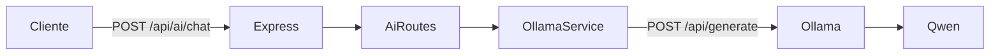

# Análise Arquitetural — AuraFit AI API

> Documento gerado a partir da análise do estado atual do repositório.  
> Data de referência: 01/08/2026.

---

## Veredito

O projeto é um **bootstrap funcional e saudável**: Express 5 → Ollama → Qwen. A integração Ollama funciona e o modelo/URL já vêm de variáveis de ambiente. Porém ainda é um **proxy de chat**, não uma plataforma de IA. A base é boa para evoluir sem reescrever.

---

## 1. Objetivo do projeto

A **AuraFit AI API** centraliza funcionalidades de IA utilizadas pelos sistemas da empresa:

- AuraFit
- SIA WEB
- CRM
- Ferramentas internas
- Integrações futuras

Stack inicial:

- Node.js
- TypeScript
- Express
- Ollama
- Qwen2.5-Coder 3B

Ambiente de execução:

| Item | Valor |
|------|--------|
| Servidor | Ubuntu Server |
| Hospedagem | CloudPanel |
| Domínio | ia-api.aurafitpro.com.br |
| Process manager | PM2 |
| LLM local | Ollama (`qwen2.5-coder:3b`) |

---

## 2. Estado atual

### 2.1 Árvore de diretórios

```
aurafit-ai-api/
├── .gitignore
├── package.json
├── package-lock.json
├── tsconfig.json
└── src/
    ├── server.ts
    ├── routes/
    │   └── ai.routes.ts
    └── services/
        └── ollama.service.ts
```

**Ausentes no momento:** `.env.example`, `README`, testes, Docker, CI, Swagger, pastas de config/controllers/middlewares/prompts/providers/rag.

### 2.2 Dependências (`package.json`)

| Tipo | Pacotes |
|------|---------|
| Produção | `axios`, `cors`, `dotenv`, `express` (^5.1.0), `helmet` |
| Desenvolvimento | `@types/cors`, `@types/express`, `@types/node`, `ts-node-dev`, `typescript` |

**Scripts:**

- `dev` → `ts-node-dev src/server.ts`
- `build` → `tsc`
- `start` → `node dist/server.js`

**Não instalados ainda:** JWT, rate-limit, zod/joi, winston/pino, swagger, jest/vitest, morgan.

### 2.3 Endpoints existentes

| Método | Path | Arquivo | Comportamento |
|--------|------|---------|---------------|
| `GET` | `/` | `src/server.ts` | Health: `{ status: "online", service: "AuraFit AI API" }` |
| `POST` | `/api/ai/chat` | `src/routes/ai.routes.ts` | Body `{ prompt }` → Ollama → `{ success, response }` |

### 2.4 Fluxo atual



### 2.5 Integração Ollama

| Item | Detalhe |
|------|---------|
| Arquivo | `src/services/ollama.service.ts` |
| Função | `generateAI(prompt: string)` |
| Cliente | `axios.create({ baseURL: process.env.OLLAMA_URL })` |
| Endpoint Ollama | `POST /api/generate` |
| Payload | `{ model: process.env.MODEL, prompt, stream: false }` |
| Retorno | `response.data.response` |

Variáveis de ambiente usadas: `PORT`, `OLLAMA_URL`, `MODEL`.

### 2.6 TypeScript

- `strict: true` habilitado
- `target: ES2020`, `module: commonjs`
- Sem `paths`, source maps explícitos ou `noUncheckedIndexedAccess`
- Uso de `error: any` na rota enfraquece o strict na prática

---

## 3. Estrutura atual vs estrutura desejada

| Pasta sugerida | Status |
|----------------|--------|
| `config/` | Ausente |
| `controllers/` | Ausente (lógica na rota) |
| `routes/` | Existe (`ai.routes.ts`) |
| `services/` | Existe (`ollama.service.ts`) |
| `middlewares/` | Ausente |
| `models/` | Ausente |
| `repositories/` | Ausente |
| `utils/` | Ausente |
| `types/` | Ausente |
| `prompts/` | Ausente |
| `providers/` | Ausente |
| `ollama/` | Ausente (só service) |
| `embeddings/` | Ausente |
| `rag/` | Ausente |
| `github/` | Ausente |

---

## 4. Problemas encontrados

| # | Problema | Risco | Impacto |
|---|----------|-------|---------|
| 1 | Lógica de negócio na rota (sem controller) | Médio | Dificulta testes e novos endpoints |
| 2 | Sem pasta `config/` — env lida espalhada | Médio | Modelo/URL sem validação no boot |
| 3 | Possível race do `dotenv` vs axios no load do módulo | Alto | `OLLAMA_URL` pode ficar `undefined` |
| 4 | CORS aberto (`cors()` sem whitelist) | Alto | Qualquer origem acessa a API |
| 5 | Sem autenticação (API Key / JWT) | Alto | Endpoint público se exposto |
| 6 | Sem rate limit | Alto | Abuso / sobrecarga do Ollama |
| 7 | Validação frágil (`if (!prompt)`) + `error: any` | Médio | Prompts vazios/gigantes; tipagem fraca |
| 8 | Erros internos vazados no JSON 500 | Médio | Vazamento de detalhes internos |
| 9 | Só `console.log` / `console.error` | Baixo | Logs sem nível, contexto ou rotação |
| 10 | Sem `.env.example`, README, Swagger | Baixo | Onboarding e integração difíceis |
| 11 | Sem timeout no axios | Médio | Request pode travar indefinidamente |
| 12 | Sem specialists/prompts/RAG/providers | — | Esperado neste estágio |
| 13 | `PORT` sem default/validação | Médio | `listen(undefined)` se env faltar |

### O que já está bem

- Modelo e URL via env (não hardcoded)
- Helmet ativo
- TypeScript `strict: true`
- Separação mínima routes/services
- `.env` no `.gitignore`

---

## 5. Segurança — diagnóstico

| Área | Situação |
|------|----------|
| API keys | Nenhuma autenticação de cliente |
| JWT | Não usado |
| CORS | `cors()` sem opções — aberto a qualquer origem |
| Helmet | Ativo |
| Rate limit | Não há |
| Validação | Só presença de `prompt`; sem schema/tamanho |
| Error handling | try/catch local; `error.message` vazado no JSON 500 |
| Global error middleware | Não há |
| Secrets no repo | Nenhum token hardcoded encontrado |

---

## 6. Logging — diagnóstico

- Apenas `console.log` (startup) e `console.error` (erros na rota)
- Sem Winston/Pino/Morgan
- Pasta `logs/` apenas no `.gitignore`
- Sem request id, níveis ou estruturação

---

## 7. Especialistas / prompts — diagnóstico

Nenhum. Não há pasta `prompts/`, system prompts, personas ou specialists. O `prompt` do body vai direto ao Ollama.

---

## 8. Valores hardcoded e pontos frágeis

**Hardcoded (aceitáveis por enquanto):**

- Path Ollama `/api/generate`
- `stream: false`
- Nome do serviço `"AuraFit AI API"`

**Não hardcoded (correto):**

- Modelo (`MODEL`)
- URL do Ollama (`OLLAMA_URL`)

**Pontos frágeis:**

- Cliente axios criado no load do módulo (timing com dotenv)
- Sem timeout no axios
- Sem validação de env no boot
- Sem `.env.example`

---

## 9. Melhorias sugeridas (com impacto)

### 9.1 Estruturais (baixo risco)

1. **`config/env.ts`** — validar `PORT`, `OLLAMA_URL`, `MODEL` no boot; defaults seguros. Corrige race do dotenv e falhas silenciosas.
2. **Controller + Service** — extrair lógica da rota. Preservar `POST /api/ai/chat` (ou alias `/api/chat`).
3. **Logger (Pino)** — substitui `console.*`; preparado para PM2/produção.
4. **Error middleware global** — respostas padronizadas; sem vazar stack.
5. **`.env.example` + README** — documentação mínima de deploy.
6. **Timeout no client Ollama** — evita requests pendurados.

### 9.2 Segurança (médio risco, alto valor)

7. **API Key middleware** — suficiente para SIA/AuraFit no início; JWT depois.
8. **CORS configurável** — origins via env.
9. **Rate limit** — protege Ollama em servidor único.
10. **Validação com Zod** — body tipado, tamanho máximo de prompt.

### 9.3 Plataforma de IA (evolução)

11. **Provider abstrato** (`ILlmProvider`) — Ollama como implementação; futuro: APIs externas.
12. **Pasta `prompts/` + specialists** — system prompts por domínio.
13. **Endpoints especializados** — `/api/sql/*`, `/api/code/*`, etc., reutilizando o provider.
14. **RAG/embeddings** — interface de vector store (Qdrant/PgVector) sem acoplar agora.
15. **Swagger/OpenAPI** — contrato para consumidores.

---

## 10. Plano de evolução por fases

### Fase 0 — Fundação (1–2 dias) · baixo risco

**Objetivo:** organizar sem quebrar o chat atual.

- Criar `config/`, `controllers/`, `middlewares/`, `types/`, `utils/`
- Centralizar env com validação no boot
- Extrair `AiController` + manter rota compatível
- Logger Pino
- Error handler global
- `.env.example` + README básico
- Timeout no client Ollama

**Compatibilidade:** `POST /api/ai/chat` permanece.

---

### Fase 1 — Segurança e operação (2–3 dias)

**Objetivo:** API pronta para rede interna / CloudPanel.

- API Key (`x-api-key`)
- CORS por env (`CORS_ORIGINS`)
- Rate limit (`express-rate-limit`)
- Validação Zod nos bodies
- Health enriquecido (`/api/admin/status` — Ollama reachable, modelo ativo)
- Logs estruturados (request id, duração)

---

### Fase 2 — Camada de providers e especialistas (3–5 dias)

**Objetivo:** sair do “pass-through” de prompt.

Estrutura alvo:

```
providers/
  llm.provider.ts          # interface
  ollama/
    ollama.provider.ts
prompts/
  specialists/
    sql.prompt.ts
    nodejs.prompt.ts
    crm.prompt.ts
    ...
services/
  specialist.service.ts
  chat.service.ts
```

- Modelo sempre via config
- Endpoints: `/api/chat`, `/api/sql/generate`, `/api/sql/analyze`, `/api/code/generate`, `/api/code/review`
- Alias de compatibilidade: `/api/ai/chat` → mesmo handler

---

### Fase 3 — Documentação e DX (1–2 dias)

- Swagger/OpenAPI em `/api/docs`
- Exemplos de curl / Postman
- Contratos TypeScript (DTOs) exportáveis

---

### Fase 4 — Integrações SIA / AuraFit (contínuo)

- `/api/crm/message`, `/api/logs/analyze`
- Headers de auditoria (`X-Client-App`: sia | aurafit | crm)
- Histórico de conversas (persistência simples, se necessário)

Funcionalidades previstas por sistema:

| Sistema | Casos de uso |
|---------|----------------|
| SIA WEB | SQL (gerar/analisar/explicar/corrigir), código, logs, CRM, documentação |
| AuraFit | Suporte interno, assistente de programação, mensagens, análise de problemas |

---

### Fase 5 — RAG e memória (médio prazo)

- Interface `IVectorStore` (Qdrant / PgVector / Chroma / Milvus)
- `/api/document/search`, embeddings
- Sem escolher engine agora — só o contrato

---

### Fase 6 — Multi-modelo e tools (longo prazo)

- `/api/models/list`, `/api/models/select`
- Providers externos (OpenAI-compatible, etc.)
- Tool calling para agentes especializados
- Modelos futuros: Gemma, DeepSeek, Mistral, Llama (sempre via config)

---

## 11. Princípios para a implementação

1. **Não quebrar** `POST /api/ai/chat` nem a integração Ollama atual.
2. **Não criar pastas vazias** sem uso imediato (`rag/`, `github/` só quando houver código).
3. **Uma abstração por vez** — provider LLM antes de vector store.
4. **Configuração > hardcode** — sempre env.
5. **KISS** — estrutura enxuta agora; profundidade depois.
6. Seguir Clean Code, SOLID, DRY, TypeScript strict; evitar `any` e duplicação.

---

## 12. Endpoints futuros (visão)

| Método | Path | Finalidade |
|--------|------|------------|
| `POST` | `/api/chat` | Chat genérico |
| `POST` | `/api/sql/generate` | Geração de SQL |
| `POST` | `/api/sql/analyze` | Análise de SQL |
| `POST` | `/api/code/generate` | Geração de código |
| `POST` | `/api/code/review` | Revisão de código |
| `POST` | `/api/logs/analyze` | Análise de logs |
| `POST` | `/api/crm/message` | Mensagens CRM |
| `POST` | `/api/document/search` | Busca em documentação (RAG) |
| `GET` | `/api/models/list` | Listar modelos |
| `POST` | `/api/models/select` | Selecionar modelo |
| `GET` | `/api/admin/status` | Status operacional |

---

## 13. Especialistas previstos

Cada especialista terá prompts próprios em arquivos separados:

- SQL
- Node.js
- TypeScript
- CRM
- Banco de Dados
- DevOps
- Docker
- Linux
- Git

---

## 14. Recomendação imediata

Começar pela **Fase 0**: reorganização estrutural + config tipada + logger + error handler, mantendo o endpoint atual intacto. É o maior ganho com menor risco.

Em seguida, avançar para a **Fase 1** (segurança e operação) antes de expandir especialistas e RAG.

---

## Referência rápida dos arquivos atuais

| Arquivo | Responsabilidade |
|---------|------------------|
| `src/server.ts` | Bootstrap Express, CORS, Helmet, health, mount de rotas |
| `src/routes/ai.routes.ts` | `POST /chat` — validação mínima e chamada ao service |
| `src/services/ollama.service.ts` | Wrapper axios para Ollama `/api/generate` |
| `tsconfig.json` | Compilação TypeScript (`strict: true`) |
| `package.json` | Dependências e scripts |
| `.gitignore` | Ignora `node_modules`, `dist`, `.env`, logs |
